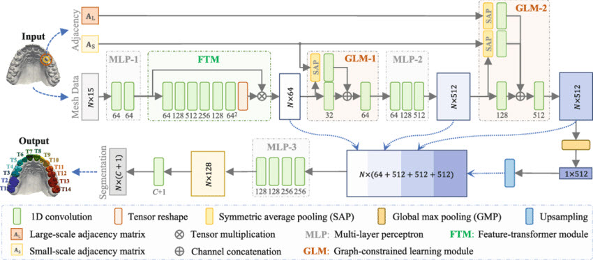
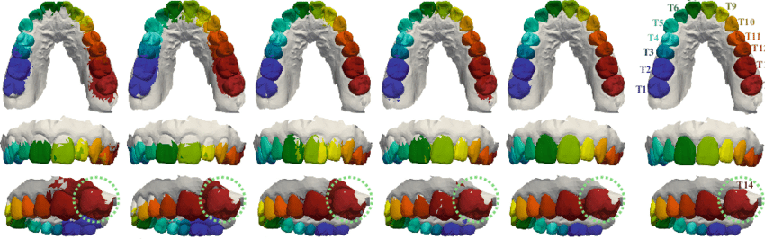
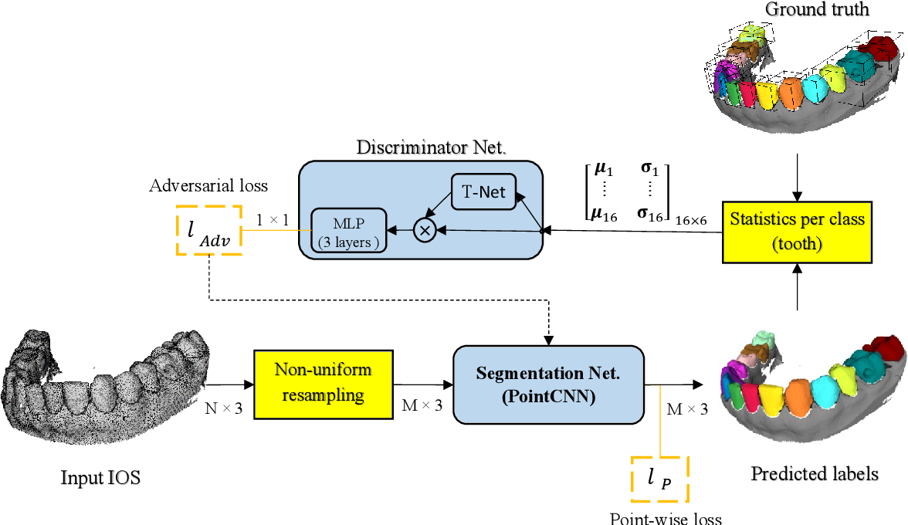

# 3D-Deep-Learning-in-Dentistry 

## CNN
<b>MeshSNet: Deep Multi-scale Mesh Feature Learning for End-to-End Tooth Labeling on 3D Dental Surfaces (MICCAI 2019)</b> [[Paper]](https://www.researchgate.net/profile/Mingxia-Liu/publication/336465259_MeshSNet_Deep_Multi-scale_Mesh_Feature_Learning_for_End-to-End_Tooth_Labeling_on_3D_Dental_Surfaces/links/5e28a0aa299bf1521675ac8c/MeshSNet-Deep-Multi-scale-Mesh-Feature-Learning-for-End-to-End-Tooth-Labeling-on-3D-Dental-Surfaces.pdf)
 

Illustration of MeshSNet

Segmentations produced by five different methods

 

<b>Deep Learning Approach to Semantic Segmentation in 3D Point Cloud Intra-oral Scans of Teeth (PMLR 2019)</b> [[Paper]](http://proceedings.mlr.press/v102/ghazvinian-zanjani19a/ghazvinian-zanjani19a.pdf)

 